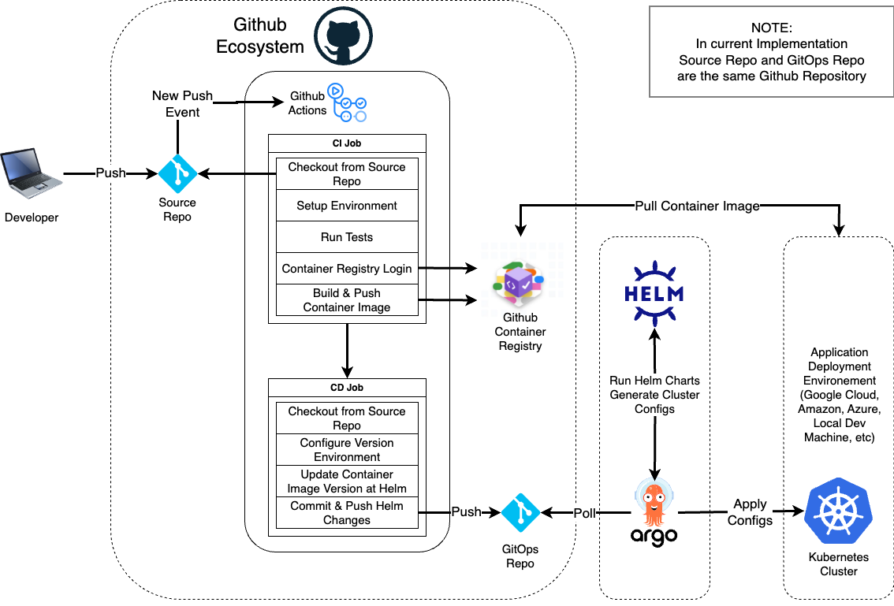

# kbot
DevOps Course test application

### Github Actions GitOps Workflow Scheme

This repository contains CI/CD pipeline definitions for [Github Actions](.github/workflows/cicd.yaml), [Jenkins](pipeline/jenkins.groovy) and [Gitlab CI](.gitlab-ci.yml). Note that Jenkins and Gitlab pipeline examples does not contain CD pipeline, so they do not update Helm charts repository code.

### Bitbucket & Jenkins to Gitlab & Gitlab CI Migration

Pros and Cons of such migration are described here: [Detailed Notes](docs/bitbucket_jenkins_to_gitlab_ci_migration.md) and [Short Notes](docs/migration_comparison_notes.md)

### Gitlab CI Migration Conclusion
Jenkins is highly configurable, has huge set of plugins for any need of the CI pipeline script. Main problems are configuration all neeeded plugins and keeping them up to date with their working versions. Also Jenkins needs to be hosted somewhere and as it requires Java. Accoring to local testing, it needs quite enough hardware resources to run it's ecosystem and pipeline jobs fast. It seems to be quite a hassle to keep it running and up to date.

Gitlab ecosystem, along with git repository hosting and container storage serivce, also provides cloud and self hosted solutions for Gitlab and CI. Gitlab CI can be triggered on some events, for example push at repository, manual CI job start execution is also possible. Even free version is enough to cover needs of the provided Jenkinsfile. Gitlab CI has good documentation and big community at Stack Overflow, Gitlab Forum and other sites and blogs.

Gitlab CI pipeline is described in the a simple YAML file. Syntax is very easy to write and refactor, also it reads almost like a human language.

So, migration from Jenkins to Gitlab CI is very recommended.

##### Used Links for Migration
* [Tutorial: Create a complex pipeline](https://docs.gitlab.com/ee/ci/quick_start/tutorial.html)
* [Configure a list of selectable prefilled variable values](https://docs.gitlab.com/ee/ci/pipelines/index.html#configure-a-list-of-selectable-prefilled-variable-values)
* [Golang CI Example](https://gitlab.com/gitlab-org/gitlab/-/blob/master/lib/gitlab/ci/templates/Go.gitlab-ci.yml)
* [Build Golang Docker images with GitLab CI Pipelines](https://akyriako.medium.com/build-golang-docker-images-with-gitlab-ci-pipelines-2117f8505350)
* [Passing Docker Image Between Build and Test Stage in GitLab Runner](https://forum.gitlab.com/t/passing-docker-image-between-build-and-test-stage-in-gitlab-runner/2444/7)

### Link to telegram bot
[kbot](https://t.me/test_284709_bot)

### Setup
* Create your own telegram bot with BotFather bot. Use command `/newbot`. It will ask for bot name and bot telegram user name. Provide these values.
In final response message there will be API token, click at this message once to copy this token.
* Call command `read -s TELE_TOKEN` to read from the input, use insert from buffer hotkey aka `CMD+V`, `CTRL+V`, and hit enter
* Check saved token with `echo $TELE_TOKEN` terminal command
* Use `export TELE_TOKEN` to export this variable into the environment
* start Kbot with `./kbot start` command
* Open your telegram bot link that was obtained at the BotFather and start typing some bot commands

### Build Generation
* Each make and build command has such environment variables `TARGETOS`, `TARGETARCH` they define target operation system and processor architecture. See variables logic details at `Makefile`.
* See supported os and architecture values here [Golang Environment](https://go.dev/doc/install/source#environment)
* `TARGETOS=darwin TARGETARCH=arm64 make build` - this example command will prepare application binary file
* `make image` - create docker image
* `make push` - push docker image into registry
* `make clean` - remove binary and docker image

### Run application via Docker
* `docker run suhovius/kbot:v1.0.9-3019ec6-darwin-arm64`

### Supported Commands

`/start hello` - see bot version. Output example: `'Hello I'm Kbot 1.0.2!'`

`/start rand` - generate random number. Output example: `'Here is some random number 3!'`

### TODO:
* TODO: Add CI/CD schema with Github Actions, Jenkins, Gilab CI and ArgoCD/Helm
* TODO: Update Build generation with proper commands
